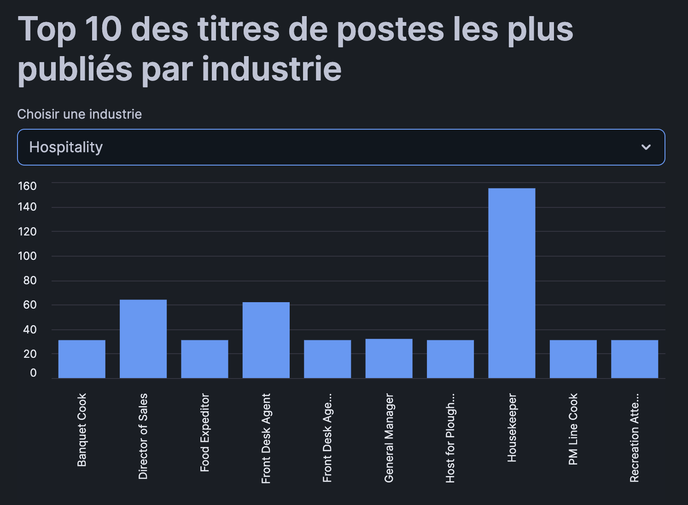
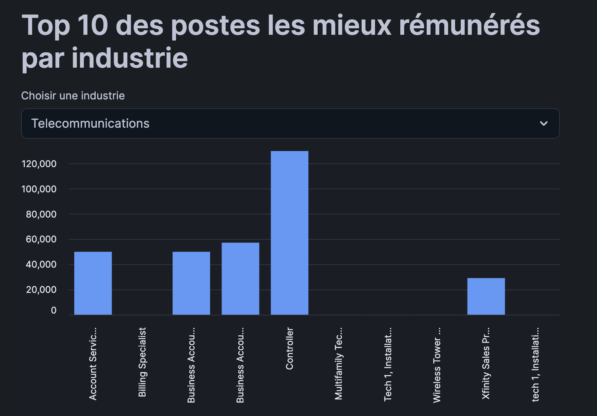
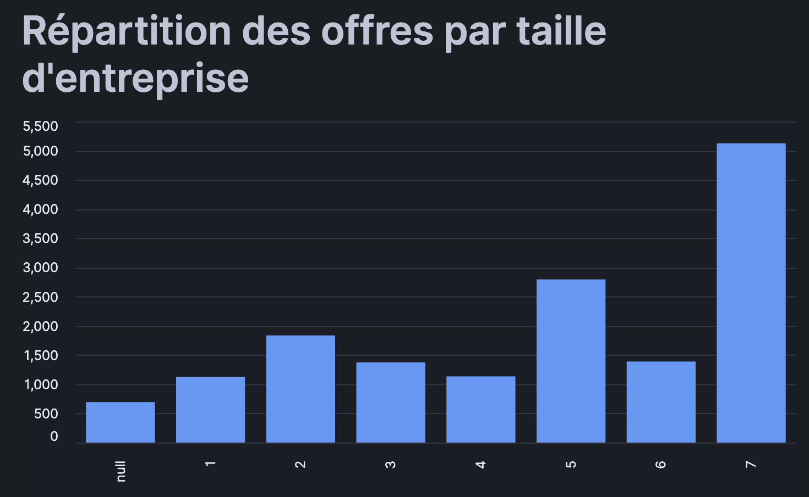
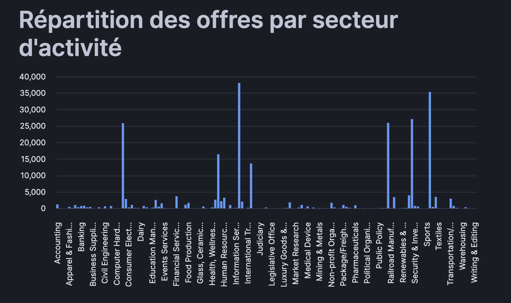
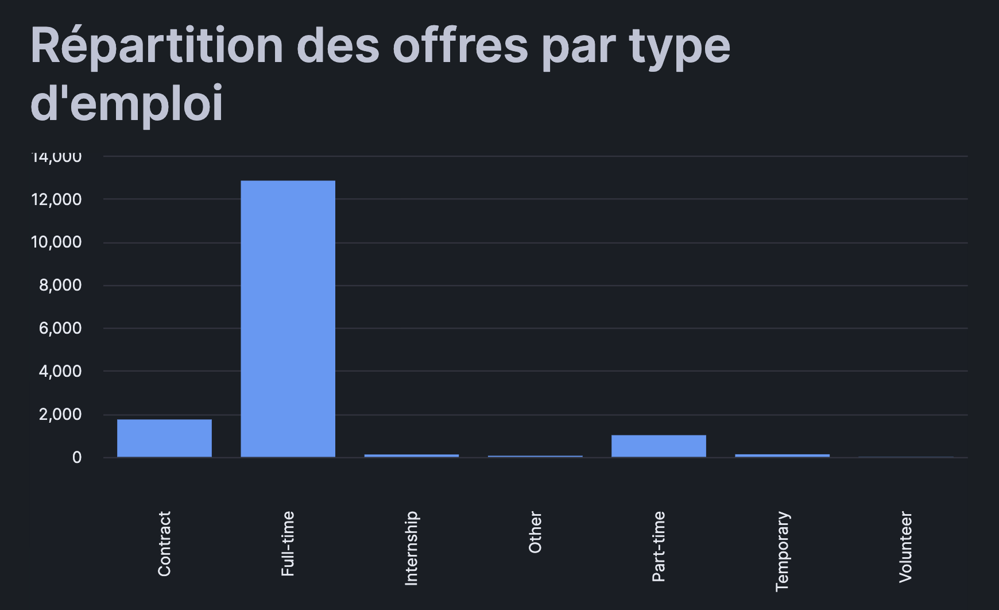

# Projet : Analyse des Offres d'Emploi LinkedIn avec Snowflake

**Groupe :** Mia Teixeira, Moé Al-Asbahi  
**École :** ESME  
**Année :** 2026

---

## Objectif

Pour ce projet, on a utilisé un dataset LinkedIn contenant des milliers d'offres d'emploi. L'idée c'était de charger ces données dans Snowflake, les nettoyer, puis créer des visualisations avec Streamlit pour analyser le marché de l'emploi.

---

## Architecture Medallion

On a organisé les données en 3 couches, c'est ce qu'on appelle l'architecture Medallion :

- **Bronze** : on charge les fichiers tels quels depuis S3, sans rien toucher. C'est la "source de vérité".
- **Silver** : on nettoie et on type les données correctement (dates, nombres, booléens...).
- **Gold** : on crée des vues avec les données agrégées, prêtes pour les graphiques.

---

## Notebooks Snowflake

- [Bronze](https://app.snowflake.com/apqavtf/yhb73244/#/workspaces/ws/USER%24/PUBLIC/DEFAULT%24/TPLinkesdin_Bronze.sql)
- [Silver](https://app.snowflake.com/apqavtf/yhb73244/#/workspaces/ws/USER%24/PUBLIC/DEFAULT%24/TPLinkesdin_Silver.sql)
- [Gold](https://app.snowflake.com/apqavtf/yhb73244/#/workspaces/ws/USER%24/PUBLIC/DEFAULT%24/TPLinkesdin_Gold.sql)
- [Dashboard Streamlit](https://app.snowflake.com/apqavtf/yhb73244/#/streamlit-apps/LINKEDIN.GOLD.FUYQWH3JATGNGSM2)

---

## Jeu de Données

Les fichiers sont disponibles dans le bucket S3 : `s3://snowflake-lab-bucket/`

| Fichier | Description |
|---|---|
| job_postings.csv | Offres d'emploi |
| benefits.csv | Avantages associés aux offres |
| companies.json | Informations sur les entreprises |
| company_industries.json | Secteurs par entreprise |
| company_specialities.json | Spécialités par entreprise |
| employee_counts.csv | Nombre d'employés par entreprise |
| job_industries.json | Secteurs par offre |
| job_skills.csv | Compétences par offre |

---

## Structure du Projet

---

## Phase 1 : Couche Bronze

La première étape c'était de charger les données brutes depuis le bucket S3 dans Snowflake. On a créé une base de données `LINKEDIN` avec un schéma `BRONZE`, et un stage externe qui pointe vers le bucket S3.

Pour les fichiers CSV (job_postings, benefits, employee_counts, job_skills), on a créé des tables où **toutes les colonnes sont en STRING**. On a fait ce choix pour éviter les erreurs de chargement — si une valeur de date ou de nombre est mal formatée dans le fichier source, Snowflake aurait rejeté la ligne. En mettant tout en STRING, on s'assure de tout charger sans perte.

Pour les fichiers JSON (companies, company_industries, company_specialities, job_industries), on a utilisé le type `VARIANT` qui permet de stocker du JSON brut dans Snowflake.

**Résultat :** 21 993 offres d'emploi chargées avec 0 erreur.

---

## Phase 2 : Couche Silver

Une fois les données chargées, on a créé la couche Silver pour les nettoyer et les typer correctement. Pour chaque table on a :

- Converti les colonnes numériques avec `CAST` (NUMBER, FLOAT)
- Converti les timestamps Unix en dates lisibles avec `TO_TIMESTAMP`
- Géré les valeurs nulles avec des filtres `WHERE ... IS NOT NULL`
- Extrait les champs des fichiers JSON avec la syntaxe `raw_data:champ::STRING`

**Problème rencontré :** Les colonnes `remote_allowed` et `sponsored` contenaient des valeurs `1.0` et `0.0` au lieu de `true`/`false`. Snowflake ne reconnaissait pas ces valeurs comme des booléens. On a réglé ça avec un `CASE WHEN` pour convertir manuellement.

---

## Phase 3 : Couche Gold

Pour la couche Gold, on a créé 5 vues SQL qui agrègent les données pour chaque analyse demandée. Ces vues sont directement utilisées par Streamlit pour afficher les graphiques.

**Problème rencontré :** En voulant faire la jointure entre les offres d'emploi et les entreprises, on a réalisé que la colonne `company_name` dans job_postings contenait en fait des **IDs numériques** et non des noms d'entreprises. On a donc dû joindre sur `company_id` au lieu du nom.

---

## Analyses et Résultats

### 1. Top 10 des titres de postes les plus publiés par industrie

Les postes les plus publiés varient beaucoup selon l'industrie. Dans l'IT par exemple, ce sont surtout des postes techniques, alors que dans d'autres secteurs ce sont plutôt des postes commerciaux ou managériaux.

### 2. Top 10 des postes les mieux rémunérés par industrie

Les salaires les plus élevés se trouvent dans les secteurs technologiques et financiers. Certaines industries comme Fishery n'ont qu'un seul poste avec des données salariales disponibles.

### 3. Répartition des offres par taille d'entreprise

Sans surprise, les grandes entreprises (taille 7) publient beaucoup plus d'offres que les petites. La taille est codée de 1 (plus petite) à 7 (plus grande entreprise).

### 4. Répartition des offres par secteur d'activité

Les secteurs les plus actifs en recrutement sont les ressources humaines, les textiles et la technologie grand public. Certains secteurs de niche comme la pêche ou l'agriculture ont très peu d'offres.

### 5. Répartition des offres par type d'emploi

Le temps plein (Full-time) domine largement avec plus de 12 000 offres, ce qui est logique pour LinkedIn qui est surtout utilisé pour des recherches d'emploi classiques. Les stages et le bénévolat sont très peu représentés.

---

## Technologies Utilisées

- Snowflake (SQL, Snowpark)
- Streamlit
- AWS S3 (bucket fourni, accès via Snowflake Stage)
